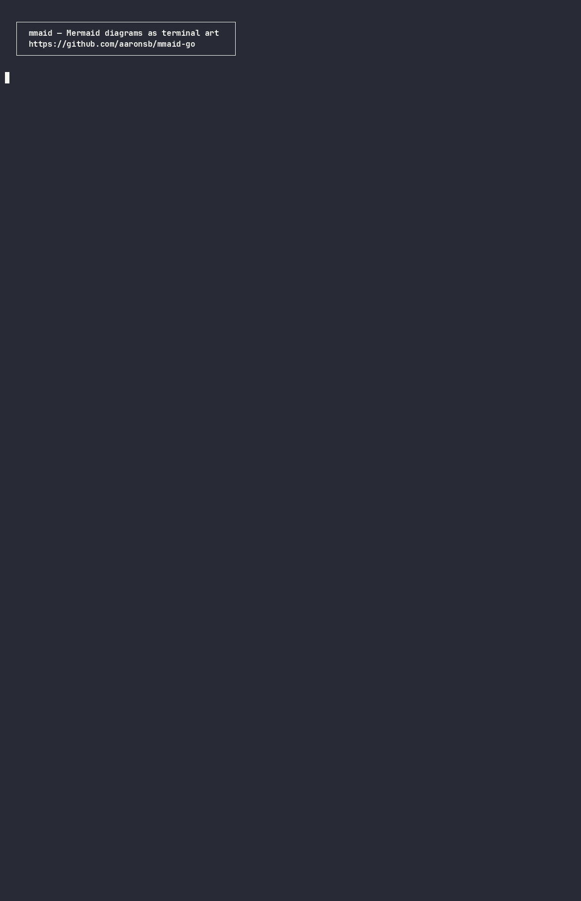

<h1 align="center">mmaid</h1>

<p align="center">Render Mermaid diagrams in your terminal. Single binary, zero dependencies.</p>

<p align="center">
  
</p>

## Features

- **20 diagram types:** flowcharts, sequence, class, ER, state, block, git graphs, pie charts, treemaps, gantt, timeline, kanban, mindmap, quadrant, XY charts, user journey, packet, requirement, C4, use case
- **Zero dependencies:** pure Go, single portable binary
- **11 color themes:** including 5 solid-background themes with depth-based region coloring
- **Anti-aliased pie charts:** circular rendering with half-block characters and supersampled edges
- **Braille fallback:** pie charts use distinct dot patterns when no color theme is active
- **ASCII mode:** works on any terminal
- **Orientation control:** `direction TB` in the diagram, or `--orientation tb`, lays a diagram out vertically — independent of terminal width ([ADR-100](docs/architecture/core/ADR-100-diagram-orientation-is-explicit-intent-distinct-from-terminal-width.md))
- **JSON ingest:** pipe structured data directly — `lsblk -Jb | mmaid --json treemap`
- **Pipe-friendly CLI:** `echo "graph LR; A-->B" | mmaid` just works

## Install

```bash
go install github.com/aaronsb/mmaid-go/cmd/mmaid@latest
```

Or build from source:

```bash
git clone https://github.com/aaronsb/mmaid-go
cd mmaid-go
make build
```

## Quick start

```bash
# Render a diagram file
mmaid diagram.mmd

# Pipe from stdin
echo "graph LR; A[Start] --> B{Check} --> C[Done]" | mmaid

# With a color theme
echo "graph LR; A --> B --> C" | mmaid -t blueprint

# Preview a theme
mmaid --demo all -t monokai
```

## Use cases

```bash
# Visualize disk usage as a treemap
du -d1 -k /var/log | awk 'NR>1{printf "        \"%s\": %d\n",$2,$1}' | \
  (echo 'treemap-beta'; echo '    "disk usage"'; cat) | mmaid -t blueprint

# Show Docker image layers
docker history --no-trunc --format '{{.Size}}\t{{.CreatedBy}}' myimage | \
  head -8 | awk -F'\t' '{gsub(/[^0-9]/,"",$1); if($1+0>0) printf "        \"%s\": %s\n",substr($2,1,30),$1}' | \
  (echo 'treemap-beta'; echo '    "layers"'; cat) | mmaid -t gruvbox

# Quick architecture sketch
cat <<'EOF' | mmaid -t blueprint
graph LR
    subgraph Frontend
        A[React App] --> B[API Client]
    end
    subgraph Backend
        C[REST API] --> D[(PostgreSQL)]
        C --> E[(Redis)]
    end
    B --> C
EOF

# Inline in Claude Code sessions
mmaid -t blueprint <<'EOF'
sequenceDiagram
    participant User
    participant Claude
    participant Tool
    User->>Claude: Request
    Claude->>Tool: mmaid render
    Tool-->>Claude: Diagram output
    Claude-->>User: Visual response
EOF
```

## Go API

```go
import mmaid "github.com/aaronsb/mmaid-go"

// Plain text
result := mmaid.Render("graph LR\n  A --> B --> C")

// With options
result := mmaid.Render(source,
    mmaid.WithTheme("blueprint"),
    mmaid.WithASCII(),
    mmaid.WithPadding(6, 3),
)
```

## Supported diagram types

Every type below has a rendered example in the [gallery](docs/gallery/README.md).

| Type | Keyword | Description |
|------|---------|-------------|
| Flowchart | `graph` / `flowchart` | Directed graphs with shapes, subgraphs, styling |
| Sequence | `sequenceDiagram` | Interaction sequences with lifelines and blocks |
| Class | `classDiagram` | UML class relationships and members |
| ER | `erDiagram` | Entity-relationship schemas with cardinality |
| State | `stateDiagram-v2` | State machines with transitions |
| Pie | `pie` | Circular charts (anti-aliased color or braille) |
| Git Graph | `gitGraph` | Branch, commit, merge, cherry-pick flows |
| Block | `block-beta` | Grid-based block layouts |
| Gantt | `gantt` | Project schedules with sections and today marker |
| Timeline | `timeline` | Chronological event sequences |
| Kanban | `kanban` | Column-based task boards |
| Mindmap | `mindmap` | Hierarchical concept maps |
| Quadrant | `quadrantChart` | 2x2 matrix plots with data points |
| XY Chart | `xychart-beta` | Bar and line charts on axes |
| Treemap | `treemap-beta` | Proportional area treemaps |
| User Journey | `journey` | Journey stages with satisfaction scores |
| Packet | `packet-beta` | Bit-field network packet layouts |
| Requirement | `requirementDiagram` | SysML requirements, elements, traceability |
| C4 | `C4Context` / `C4Container` / `C4Component` / `C4Dynamic` / `C4Deployment` | Context, container, component and deployment views |
| Use Case | `usecase-beta` | UML actors, use cases and system boundaries |

### Node shapes

Shapes are visually distinct and carry a small indicator in the upper-left corner:

| Syntax | Shape | Indicator |
|--------|-------|-----------|
| `[text]` | Rectangle (sharp corners) | — |
| `(text)` | Rounded rectangle | `◦` |
| `{text}` | Diamond (chamfered `⟋⟍`) | `◇` |
| `((text))` | Circle | `○` |
| `([text])` | Stadium | `⊂` |
| `{{text}}` | Hexagon | `⬡` |
| `[[text]]` | Subroutine | `‖` |

## CLI

```
mmaid [flags] [file]

FLAGS
  -a, --ascii          ASCII-only output (--glyphs ascii)
      --glyphs NAME    Glyph set: unicode, rounded, heavy, double, legacy, ascii
      --glyphs-sample  Print one sample line per glyph family and exit
  -t, --theme NAME     Color theme (use --themes to list)
  -v, --version        Print version
      --themes         List available themes
      --demo TYPE      Preview diagrams (all, pie, gantt, flowchart, ...)
      --padding-x N    Horizontal node padding (default: 4)
      --padding-y N    Vertical node padding (default: 2)
      --sharp-edges    Sharp corners on edge routing
      --output FILE    Write what would go to stdout to FILE
      --watch          Re-render the file whenever it changes (Ctrl-C to stop)
      --cells FILE     Write the rendered frame as a .cells dump (- is stdout)
      --cells-lint     With --cells, print structural lint findings to stderr

SUBCOMMANDS
  mmaid config show    Every setting with its resolved value and source
  mmaid config init    Probe the terminal, ask what looks wrong, write its profile
```

## Configuration

Settings live in `$XDG_CONFIG_HOME/mmaid/config.json`, else
`~/.config/mmaid/config.json`. A profile's key is the terminal's identity:
`TERM_PROGRAM` when the terminal sets it, `TERM` otherwise.

```json
{
  "default": { "theme": "blueprint", "width": 0 },
  "profiles": {
    "WezTerm": { "truecolor": true, "hyperlinks": true },
    "Apple_Terminal": { "truecolor": false }
  }
}
```

Every setting resolves in one order, first match winning: a command-line flag,
`MMAID_<SETTING>` in the environment, the terminal's profile, the file's
`default`, the built-in default. The keys are `theme`, `glyphs`, `width`,
`orientation`, `padding_x`, `padding_y`, `sharp_edges`, `truecolor`,
`hyperlinks`, `ambiguous_wide`, and `failed`; booleans read `1`, `0`, `true`
and `false`. `mmaid config show` prints each one with the layer it came from.

`NO_COLOR`, set and non-empty, drops a theme that came from the file or the
environment; `-t` still colours. `truecolor` false emits 256-colour
approximations. `hyperlinks` true wraps the label of a node named by a
`click ID "url"` line in an OSC 8 hyperlink, with or without a theme.

### Glyph sets and families

`--glyphs NAME` picks a built-in set: `unicode` (the default), `rounded`
(every light corner rounded), `heavy`, `double`, `legacy` (bars and shades
from Symbols for Legacy Computing), or `ascii`. The runes a set draws are
grouped into families, `box-light`, `box-rounded`, `box-heavy`, `box-double`,
`diagonals`, `arrows`, `blocks`, `braille`, `sextants`, `octants`,
`legacy-fills` and `ascii`, and a profile's `failed` list names the ones the
terminal's font lacks. A failed family is drawn from its fallback (heavy and
double to light, light and the fills to ASCII) and nothing else changes.

`mmaid config init` fills that list in. It reads the terminal's identity from
`TERM_PROGRAM`, the DA1 response, or `TERM`, truecolor from `COLORTERM`, and
measures how far each family's sample advances the cursor, marking a family
whose advance is wrong as failed. It then prints one numbered line per family
beside the same figure in the fallback set and asks which lines look wrong.
The answers merge into the terminal's profile as `truecolor` and `failed`;
`--no-probe` skips the terminal queries and `--force` replaces an existing
profile without asking. `mmaid --glyphs-sample` prints the same sheet.

## Themes

| Theme | Type | Description |
|-------|------|-------------|
| `default` | text | Cyan nodes, yellow arrows, white labels |
| `terra` | text | Warm earth tones |
| `neon` | text | Magenta, green, cyan |
| `mono` | text | White/gray monochrome |
| `amber` | text | Amber CRT-style |
| `phosphor` | text | Green phosphor terminal |
| `blueprint` | **solid** | Deep blue backgrounds, depth-based region colors |
| `slate` | **solid** | Dark gray backgrounds, orange accents |
| `sunset` | **solid** | Deep rose backgrounds, gold arrows |
| `gruvbox` | **solid** | Gruvbox dark palette |
| `monokai` | **solid** | Monokai dark with pink/green accents |

**Solid themes** include:
- Wallpaper fills behind chart-type diagrams
- Per-section hue with per-depth shade stepping
- Fill layer compositing (foreground elements inherit region backgrounds)
- Section-colored text labels for visual grouping

## Rendering modes

Pie charts render in three modes depending on context:

| Mode | When | Rendering |
|------|------|-----------|
| Color circle | Any `--theme` | Half-block chars with 4x4 supersampled anti-aliasing |
| Braille circle | No theme | Braille dot patterns per slice, bordered legend |
| Bar chart | `--ascii` | Horizontal bars with fill characters |

## Snapshots and goldens

`mmaid --cells FILE` interprets the ANSI stream it would have printed and
writes the resulting grid as a text frame: a `W H` header, then one line per
cell holding a codepoint and its foreground and background. `--cells-lint`
adds a structural check of the glyph grid on stderr, one line per dangling
arm, unfed arrowhead, or arm meeting an arrowhead from the wrong side. Without
`-w` a `--cells` render is 120 columns wide rather than the terminal's, so the
same source always gives the same frame.

```
make snap FILE=diagram.mmd ARGS="-t blueprint -w 100"
```

writes `.snap/diagram.cells` and `.snap/diagram.png`, prints the lint
findings, and ends with the PNG path. `ARGS` defaults to `-t default`, so a
bare `make snap` still produces a coloured frame. The PNG step needs Python 3, Pillow,
and a bitmap font; `MMAID_SNAP_FONT` overrides the default Unscii path.

`testdata/fixtures/*.mmd` render at width 120 and are compared against the
reference frames in `testdata/golden/`. `make golden` runs that comparison
and the lint; `make golden-record` rewrites the references, and the commit
that does so says which frames changed and why. `testdata/fixtures/known-bad.txt`
lists the fixtures whose frames trip the lint today.

[`docs/gallery`](docs/gallery/README.md) shows every fixture rendered from its
reference frame. `make gallery` rebuilds it, and `make golden-record` rebuilds
it after re-recording.

See ADR-101 for the format and the comparator's tolerances.

## Acknowledgements

Originally inspired by [termaid](https://github.com/saikocat/termaid) (Python) by saikocat. Rewritten in Go for portability and single-binary distribution.

Also inspired by [mermaid-ascii](https://github.com/AlexanderGrooff/mermaid-ascii) by Alexander Grooff.

## License

MIT
