# Gallery

Every fixture in `testdata/fixtures`, rendered from its reference frame in
`testdata/golden`. `make gallery` rebuilds this page; `make golden-record`
rebuilds it after re-recording the references. A fixture's first line may
carry a `%% mmaid:` directive naming the flags it renders with; the default
is `-t default -w 120`.

## architecture

Rendered with `-t default -w 120`.

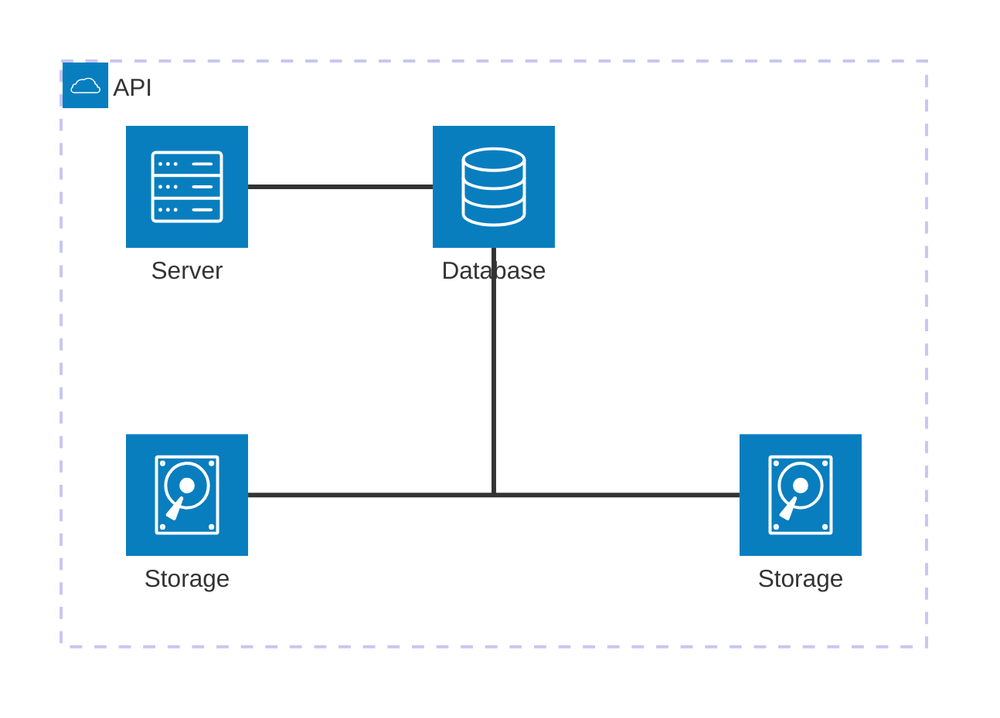
```mermaid
architecture-beta
    group api(cloud)[API]

    service db(database)[Database] in api
    service server(server)[Server] in api
    junction split in api
    service disk1(disk)[Storage] in api
    service disk2(disk)[Storage] in api

    db:L -- R:server
    db:B -- T:split
    split:L -- R:disk1
    split:R -- L:disk2
```

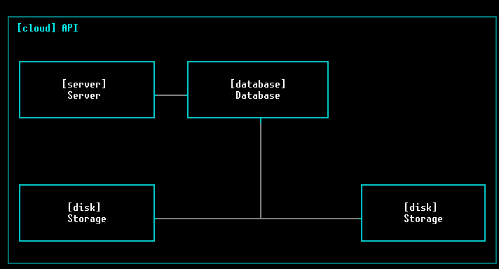

## architecture-nested

Rendered with `-t default -w 120`.

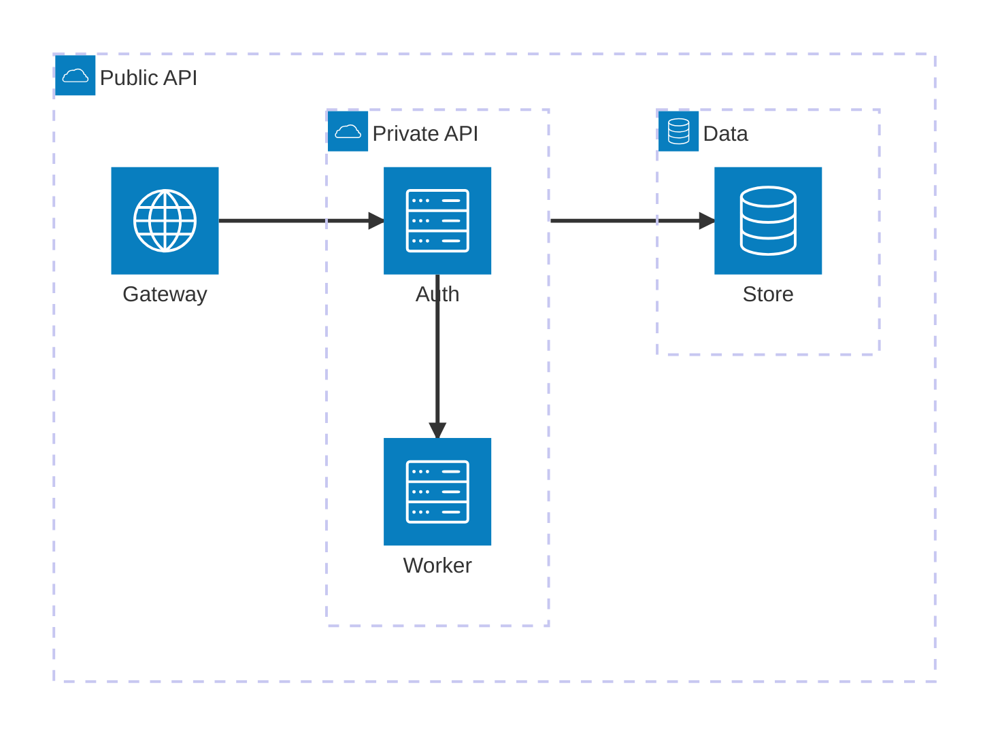
```mermaid
architecture-beta
    group public(cloud)[Public API]
    group private(cloud)[Private API] in public
    group data(database)[Data] in public

    service gateway(internet)[Gateway] in public
    service auth(server)[Auth] in private
    service worker(server)[Worker] in private
    service store(database)[Store] in data

    gateway:R --> L:auth
    auth:B --> T:worker
    auth{group}:R --> L:store
```

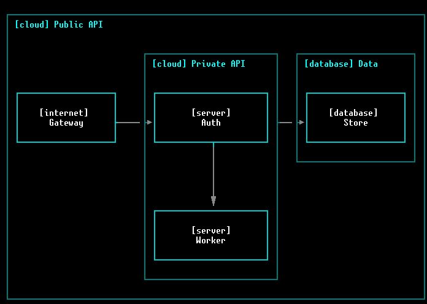

## block

Rendered with `-t default -w 120`.

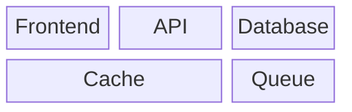
```mermaid
block-beta
    columns 3
    A["Frontend"] B["API"] C["Database"]
    D["Cache"]:2 E["Queue"]
```

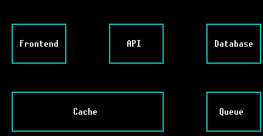

## c4

Rendered with `-t default -w 120`.

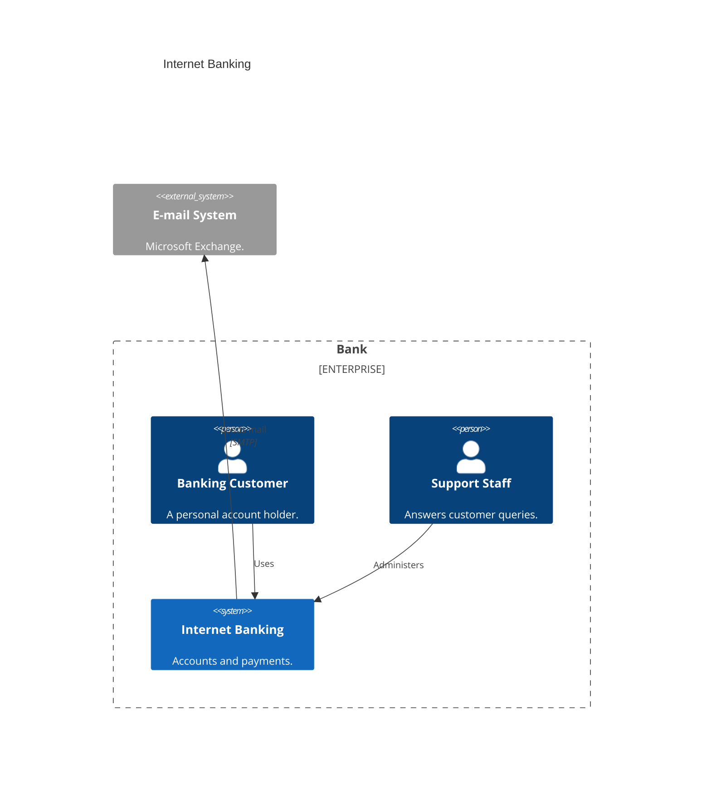
```mermaid
C4Context
    title Internet Banking
    Enterprise_Boundary(b0, "Bank") {
        Person(customer, "Banking Customer", "A personal account holder.")
        Person(staff, "Support Staff", "Answers customer queries.")
        System(banking, "Internet Banking", "Accounts and payments.")
    }
    System_Ext(email, "E-mail System", "Microsoft Exchange.")

    Rel(customer, banking, "Uses")
    Rel(staff, banking, "Administers")
    Rel(banking, email, "Sends mail", "SMTP")
```

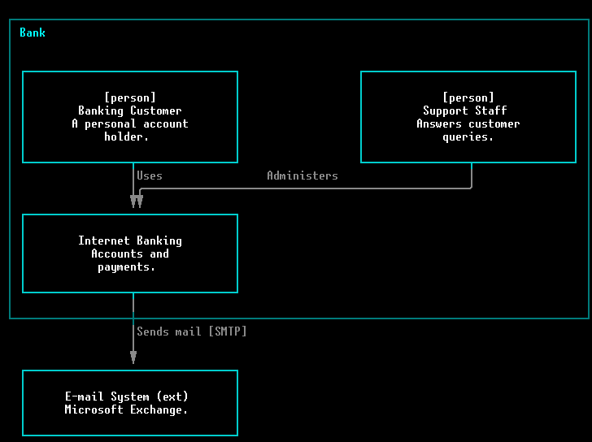

## class

Rendered with `-t mono`.

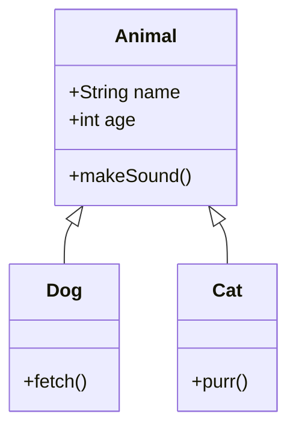
```mermaid
classDiagram
    class Animal {
        +String name
        +int age
        +makeSound()
    }
    class Dog {
        +fetch()
    }
    class Cat {
        +purr()
    }
    Animal <|-- Dog
    Animal <|-- Cat
```

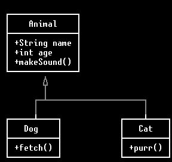

## cynefin

Rendered with `-t default -w 120`.

```mermaid
cynefin-beta
    title Incident Response
    complex
      "Investigate root cause"
      "Run a chaos experiment"
    complicated
      "Analyse performance data"
      "Expert review needed"
    clear
      "Restart the service"
      "Apply the known fix"
    chaotic
      "Page on-call immediately"
    confusion
      "Unknown failure mode"
    complex --> complicated : "Pattern identified"
    clear --> chaotic : "Complacency"
```

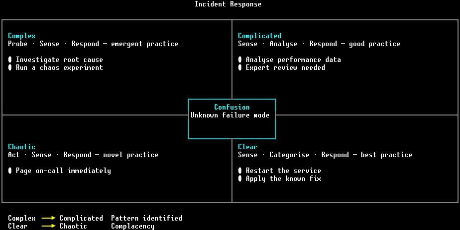

## edge-styles

Rendered with `-t default -w 120`.

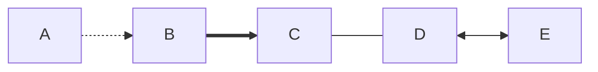
```mermaid
graph LR
    A -.-> B
    B ==> C
    C --- D
    D <--> E
```

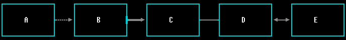

## edge-styles-ascii

Rendered with `-a`.

```mermaid
graph LR
    A -.-> B
    B ==> C
    C --- D
    D <--> E
```

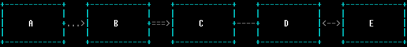

## er

Rendered with `-a`.

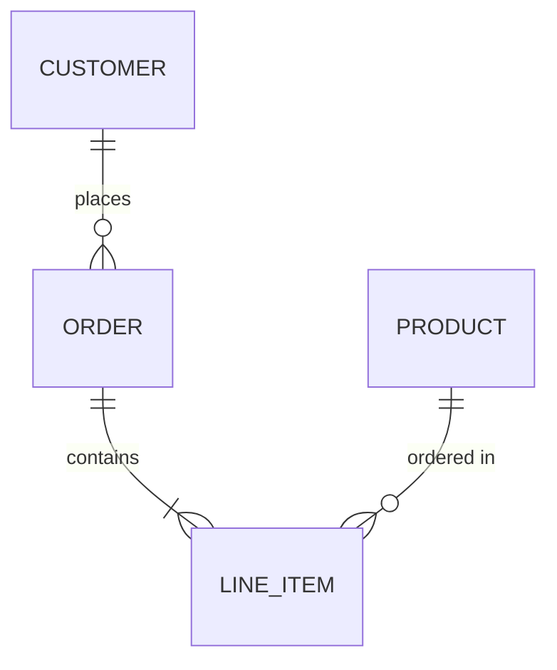
```mermaid
erDiagram
    CUSTOMER ||--o{ ORDER : places
    ORDER ||--|{ LINE_ITEM : contains
    PRODUCT ||--o{ LINE_ITEM : "ordered in"
```

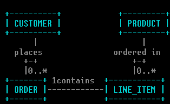

## eventmodeling

Rendered with `-t default -w 120`.

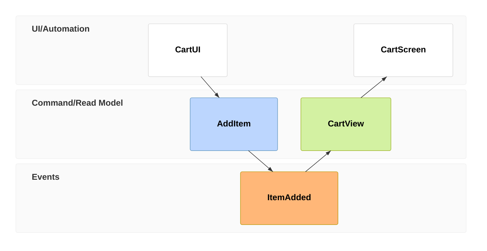
```mermaid
eventmodeling
    tf 01 ui CartUI
    tf 02 cmd AddItem ->> 01
    tf 03 evt ItemAdded ->> 02
    tf 04 rmo CartView ->> 03
    tf 05 ui CartScreen ->> 04
```

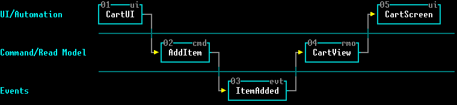

## flowchart

Rendered with `-t blueprint`.

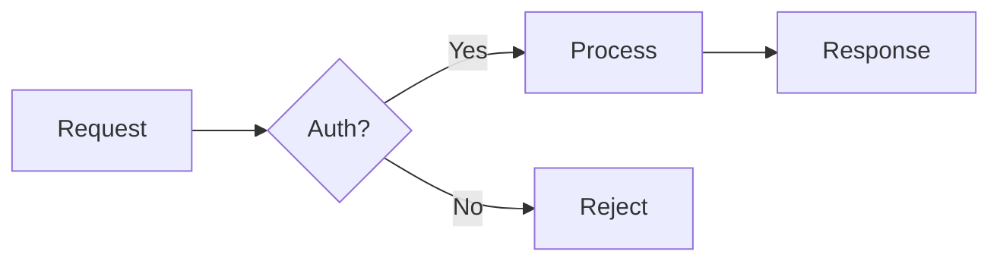
```mermaid
graph LR
    A[Request] --> B{Auth?}
    B -->|Yes| C[Process]
    B -->|No| D[Reject]
    C --> E[Response]
```

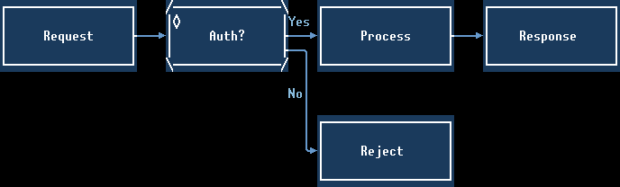

## flowchart-ascii

Rendered with `-a -t blueprint`.

```mermaid
graph LR
    A[Request] --> B{Auth?}
    B -->|Yes| C[Process]
    B -->|No| D[Reject]
    C --> E[Response]
```

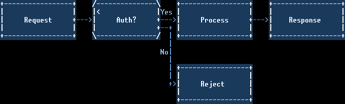

## flowchart-cross

Rendered with `-t default -w 120`.

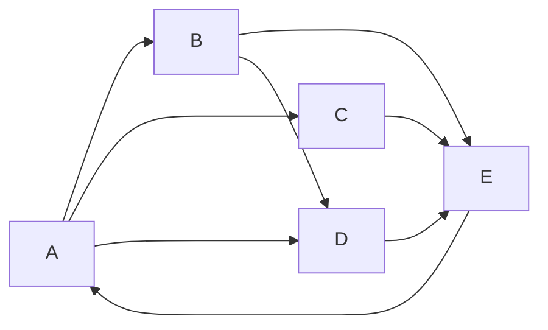
```mermaid
graph LR
    A --> B
    A --> C
    A --> D
    B --> E
    C --> E
    D --> E
    E --> A
    B --> D
```

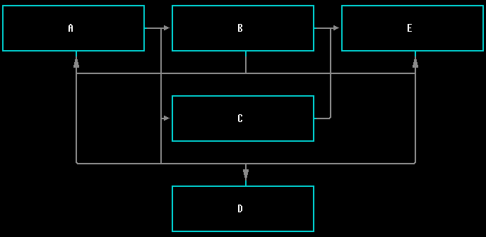

## gantt

Rendered with `-t default -w 120`.

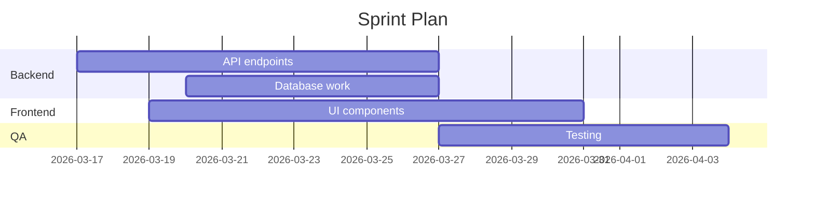
```mermaid
gantt
    title Sprint Plan
    dateFormat YYYY-MM-DD
    section Backend
        API endpoints    :a1, 2026-03-17, 10d
        Database work    :a2, 2026-03-20, 7d
    section Frontend
        UI components    :b1, 2026-03-19, 12d
    section QA
        Testing          :c1, after a2, 8d
```

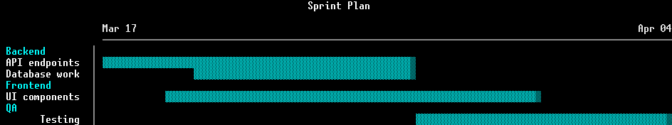

## gantt-ascii

Rendered with `-a`.

```mermaid
gantt
    title Sprint Plan
    dateFormat YYYY-MM-DD
    section Backend
        API endpoints    :a1, 2026-03-17, 10d
        Database work    :a2, 2026-03-20, 7d
    section Frontend
        UI components    :b1, 2026-03-19, 12d
    section QA
        Testing          :c1, after a2, 8d
```

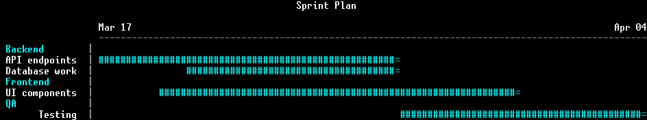

## gitgraph

Rendered with `-t default -w 120`.

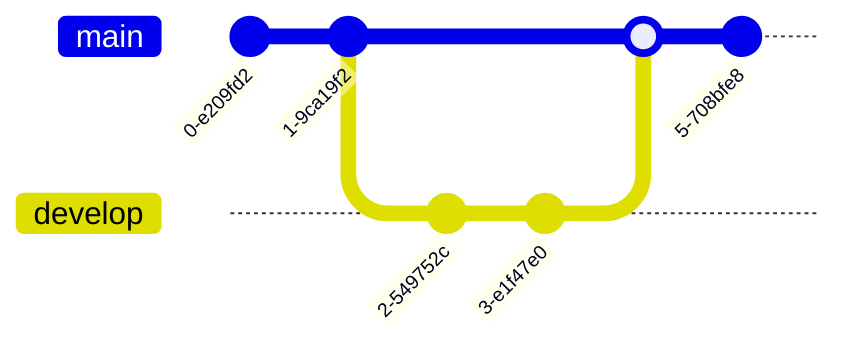
```mermaid
gitGraph
    commit
    commit
    branch develop
    checkout develop
    commit
    commit
    checkout main
    merge develop
    commit
```

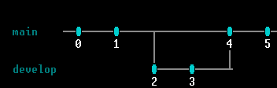

## glyph-samples

Rendered with `--glyphs-sample`.

```mermaid

```

![glyph-samples](glyph-samples.png)

## glyph-samples-legacy

Rendered with `--glyphs-sample --glyphs legacy`.

```mermaid

```

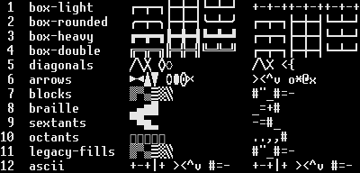

## ishikawa

Rendered with `-t default -w 120`.

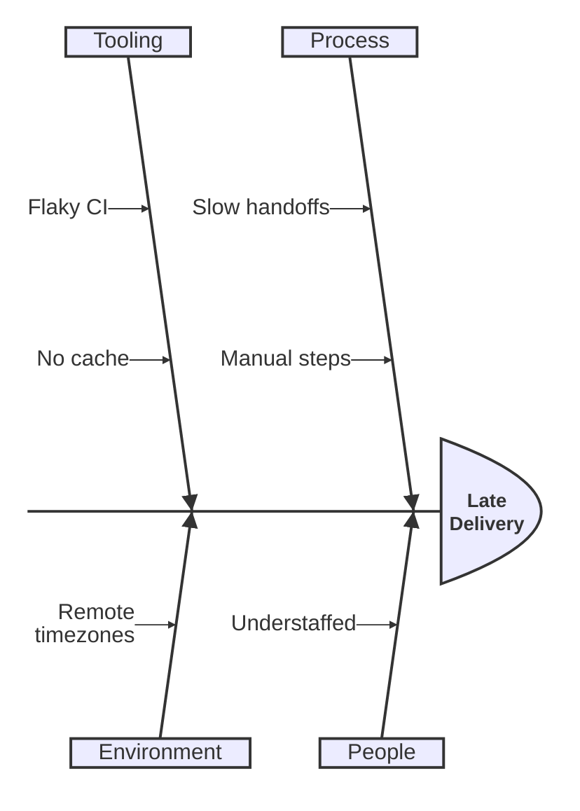
```mermaid
ishikawa-beta
    Late Delivery
        Process
            Slow handoffs
            Manual steps
        People
            Understaffed
        Tooling
            Flaky CI
            No cache
        Environment
            Remote timezones
```

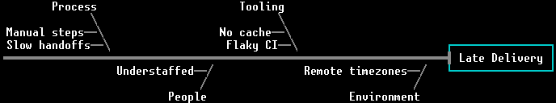

## journey

Rendered with `-t default -w 120`.

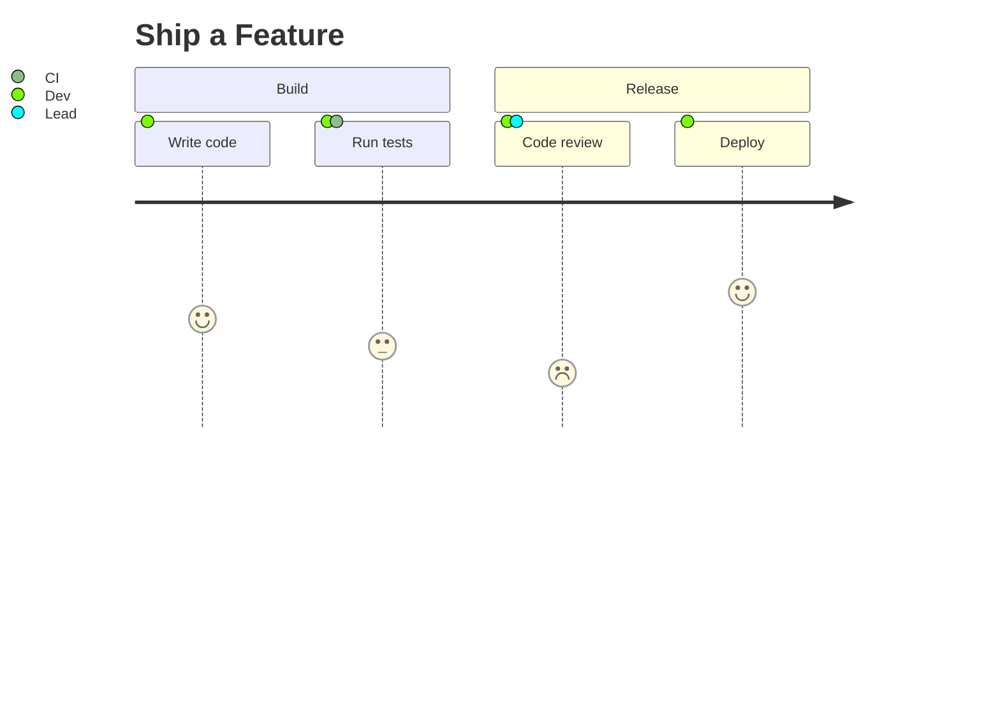
```mermaid
journey
    title Ship a Feature
    section Build
        Write code   : 4: Dev
        Run tests    : 3: Dev, CI
    section Release
        Code review  : 2: Dev, Lead
        Deploy       : 5: Dev
```

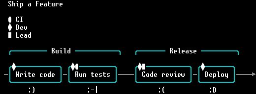

## kanban

Rendered with `-t default -w 120`.

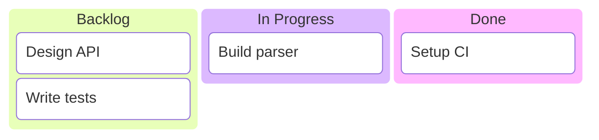
```mermaid
kanban
  col1[Backlog]
    t1[Design API]
    t2[Write tests]
  col2[In Progress]
    t3[Build parser]
  col3[Done]
    t4[Setup CI]
```

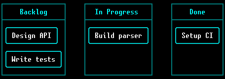

## mindmap

Rendered with `-t default -w 120`.

```mermaid
mindmap
  root((System))
    Frontend
      React
      Tailwind
    Backend
      Go
      PostgreSQL
```

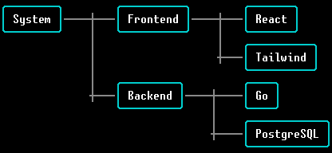

## packet

Rendered with `-t default -w 120`.

```mermaid
packet-beta
    0-15: "Source Port"
    16-31: "Destination Port"
    32-63: "Sequence Number"
    64-95: "Acknowledgment Number"
    96-99: "Data Offset"
    100-111: "Flags"
    112-127: "Window"
```

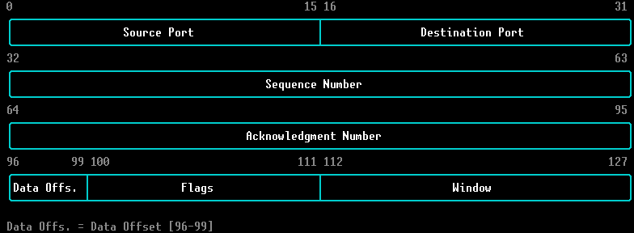

## pie

Rendered with `-t default -w 120`.

```mermaid
pie title Resource Allocation
    "Compute" : 45
    "Storage" : 25
    "Network" : 15
    "Security" : 10
    "Other" : 5
```

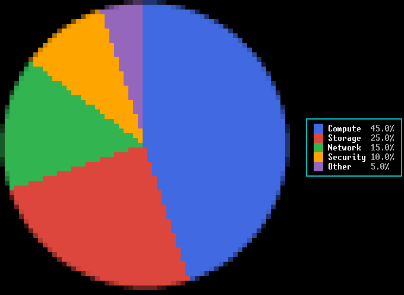

## quadrant

Rendered with `-t default -w 120`.

```mermaid
quadrantChart
    title Priority Matrix
    x-axis Low Effort --> High Effort
    y-axis Low Impact --> High Impact
    quadrant-1 Do First
    quadrant-2 Schedule
    quadrant-3 Delegate
    quadrant-4 Eliminate
    Feature A: [0.2, 0.8]
    Feature B: [0.7, 0.9]
    Feature C: [0.8, 0.3]
    Feature D: [0.3, 0.4]
```

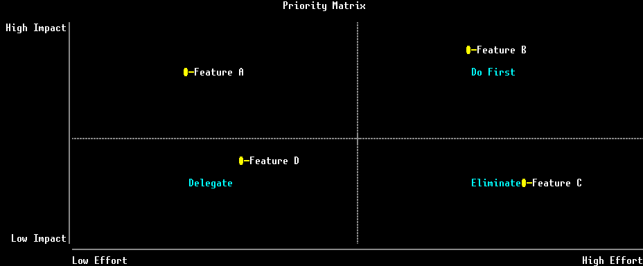

## radar

Rendered with `-t default -w 120`.

```mermaid
radar-beta
    title Service Comparison
    axis speed["Speed"], cost["Cost"], reliability["Reliability"]
    axis support["Support"], features["Features"]
    curve a["Vendor A"]{85, 60, 90, 70, 75}
    curve b["Vendor B"]{60, 90, 70, 85, 65}
    max 100
```

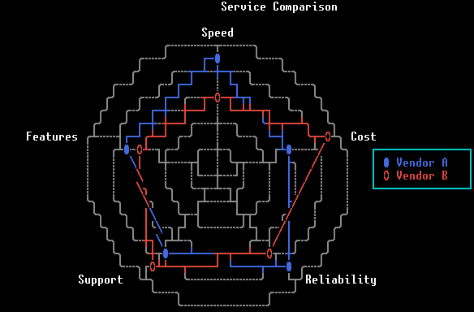

## radar-ascii

Rendered with `-a`.

```mermaid
radar-beta
    title Service Comparison
    axis speed["Speed"], cost["Cost"], reliability["Reliability"]
    axis support["Support"], features["Features"]
    curve a["Vendor A"]{85, 60, 90, 70, 75}
    curve b["Vendor B"]{60, 90, 70, 85, 65}
    max 100
```

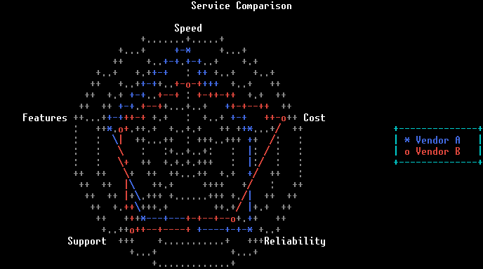

## requirement

Rendered with `-t default -w 120`.

```mermaid
requirementDiagram
    requirement checkout_req {
    id: 1
    text: Orders must be payable online.
    risk: high
    verifymethod: test
    }

    functionalRequirement payment_req {
    id: 1.1
    text: Card payments must be authorised.
    risk: high
    verifymethod: test
    }

    element checkout_service {
    type: service
    docref: docs/checkout.md
    }

    checkout_req - contains -> payment_req
    checkout_service - satisfies -> payment_req
```

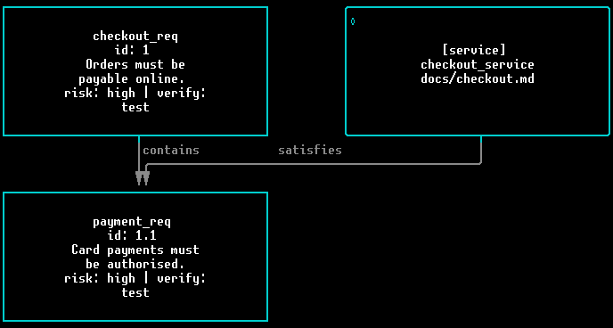

## sankey

Rendered with `-t default -w 120`.

```mermaid
sankey-beta

%% source,target,value
Coal,Electricity,45
Gas,Electricity,30
Solar,Electricity,15
Electricity,Homes,40
Electricity,Industry,35
Electricity,"Losses, grid",15
```

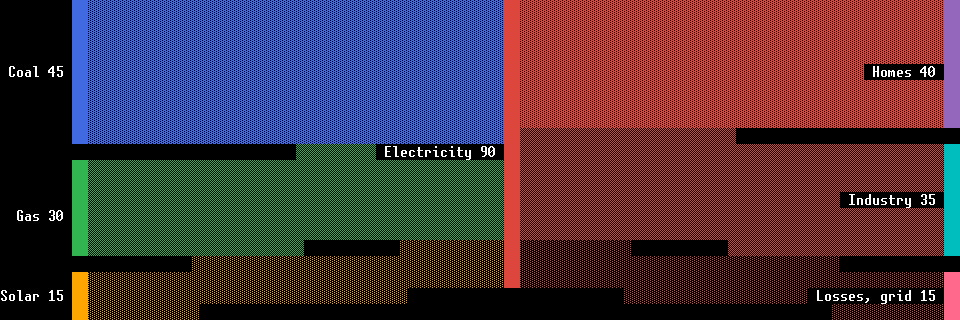

## sequence

Rendered with `-t blueprint`.

```mermaid
sequenceDiagram
    participant Client
    participant API
    participant DB
    Client->>API: GET /users
    API->>DB: SELECT *
    DB-->>API: rows
    API-->>Client: 200 OK
```

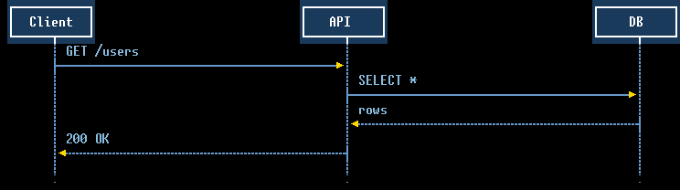

## state

Rendered with `-t blueprint`.

```mermaid
stateDiagram-v2
    [*] --> Idle
    Idle --> Processing : submit
    Processing --> Review : complete
    Review --> Idle : reject
    Review --> Done : approve
    Done --> [*]
```

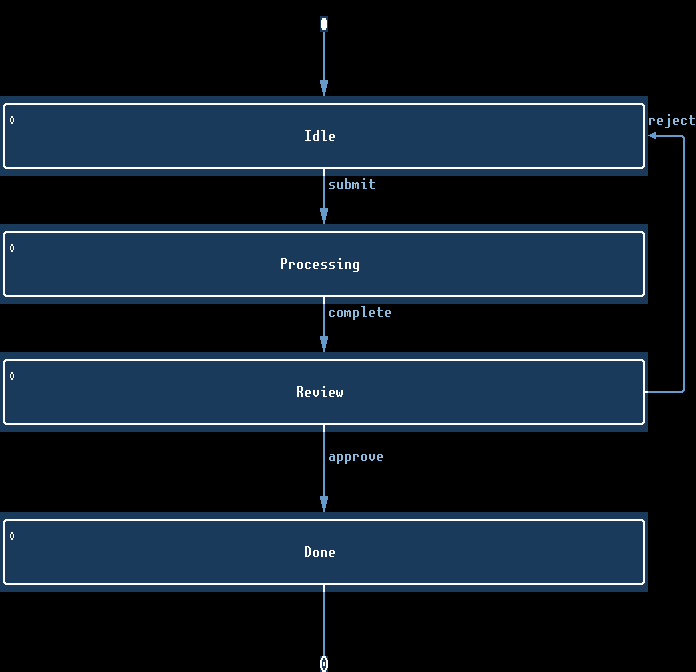

## state-label

Rendered with `-t default -w 120`.

```mermaid
stateDiagram-v2
    [*] --> Idle
    Idle --> Run : start
    Run --> Idle : stop
```

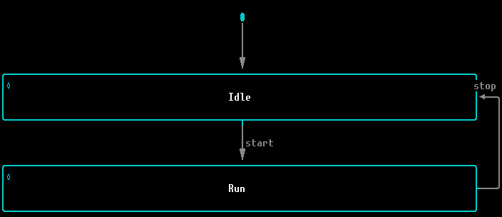

## subgraph-bend

Rendered with `-t default -w 120`.

```mermaid
graph LR
    A --> X
    subgraph S1
        X --> Y
    end
    A --> Z
    Y --> Z
    B --> Y
    B --> W
```

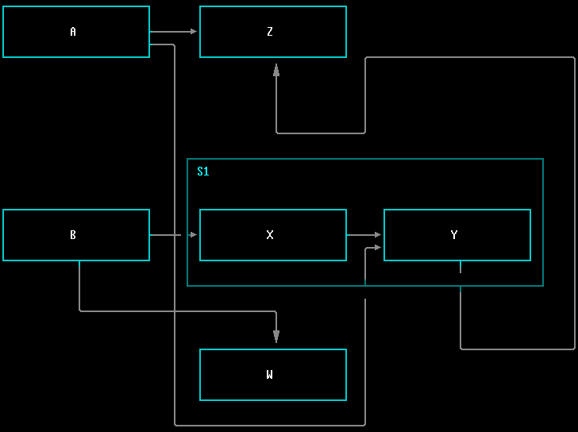

## subgraph-cross

Rendered with `-t default -w 120`.

```mermaid
graph LR
    subgraph S1
        A --> B
    end
    subgraph S2
        C --> D
    end
    A --> C
    B --> D
```

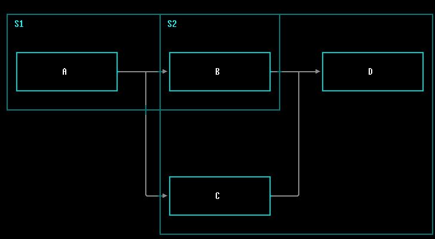

## subgraph-labelrow

Rendered with `-t default -w 120`.

```mermaid
graph TB
    P --> M
    P --> R
    subgraph S1
        M
    end
```

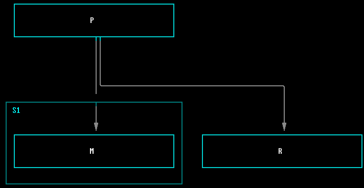

## subgraph-nested

Rendered with `-t default -w 120`.

```mermaid
graph TB
    Start --> A
    subgraph Outer
        A --> B
        subgraph Inner
            direction LR
            C --> D
        end
        B --> C
        D --> E
    end
    E --> Stop
```

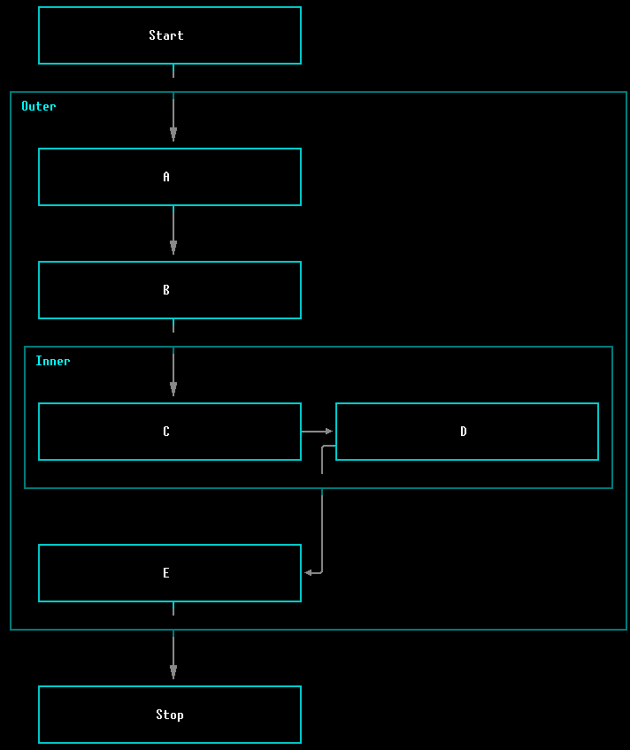

## subgraph-rl

Rendered with `-t default -w 120`.

```mermaid
graph RL
    subgraph S1
        A --> B
    end
    subgraph S2
        C --> D
    end
    A --> C
    B --> D
```

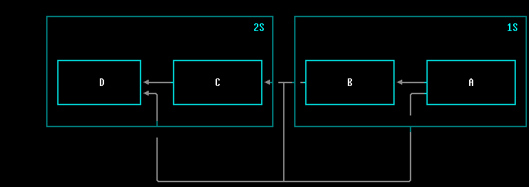

## subgraph-siblings

Rendered with `-t default -w 120`.

```mermaid
graph LR
    subgraph Input
        A --> B
    end
    subgraph Process
        C --> D
    end
    subgraph Output
        E --> F
    end
    B --> C
    D --> E
    A --> D
    C --> F
```

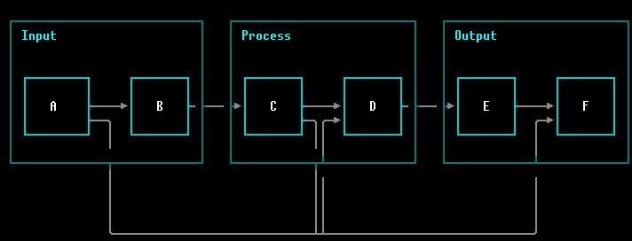

## subgraph-target

Rendered with `-t default -w 120`.

```mermaid
graph TB
    subgraph S0
        A
        E
    end
    C --> B
    A ----> G
    B --> S0
    E ----> C
    B --> A
```

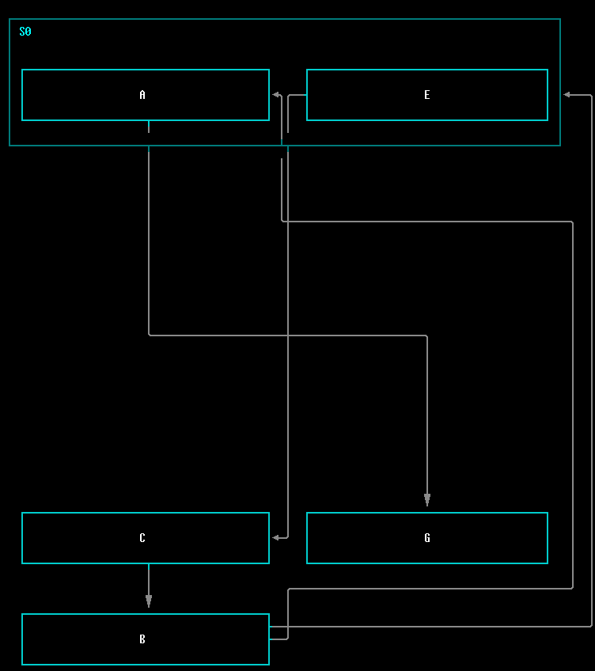

## subgraph-widelabel

Rendered with `-t default -w 120`.

```mermaid
graph TB
    subgraph "A very very very long subgraph label that is wider than its block"
        A
    end
    subgraph S2
        B
    end
    A --> C
    B --> C
```

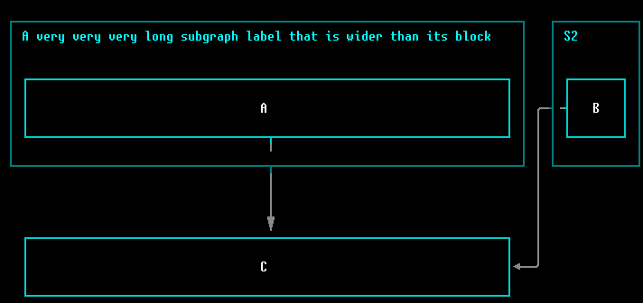

## swimlane

Rendered with `-t default -w 120`.

```mermaid
swimlane-beta TB
  subgraph Intake
    collect[Collect request]
    validate[Validate details]
  end

  subgraph Review
    review[Review request]
    decide{Ready?}
  end

  subgraph Delivery
    schedule[Schedule work]
    complete[Complete work]
  end

  collect --> validate --> review --> decide
  decide -->|Yes| schedule --> complete
  decide -->|No| collect
```

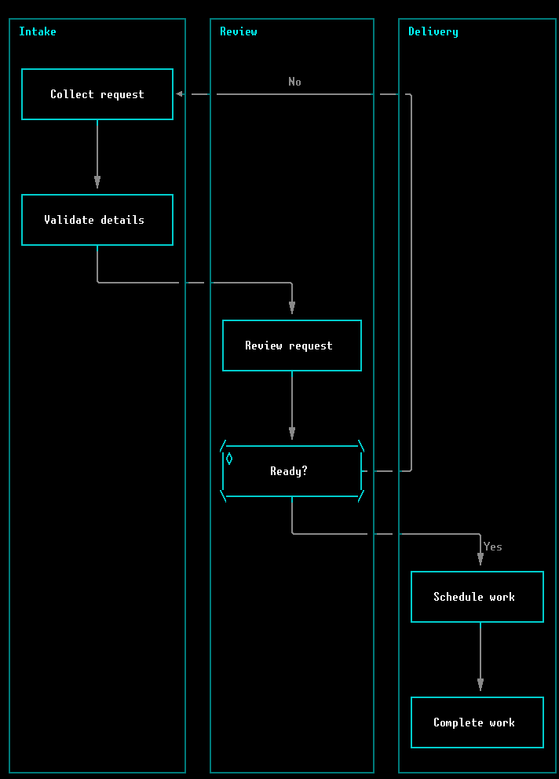

## swimlane-lr

Rendered with `-t default -w 120`.

```mermaid
swimlane-beta LR
  subgraph Customer
    request[Request service]
    receive[Receive update]
  end

  subgraph Support
    triage[Triage request]
    answer[Send answer]
  end

  subgraph Engineering
    investigate[Investigate issue]
    fix[Prepare fix]
  end

  request --> triage
  triage -->|Known issue| answer
  triage -->|Needs code change| investigate
  investigate --> fix --> answer
  answer --> receive
```

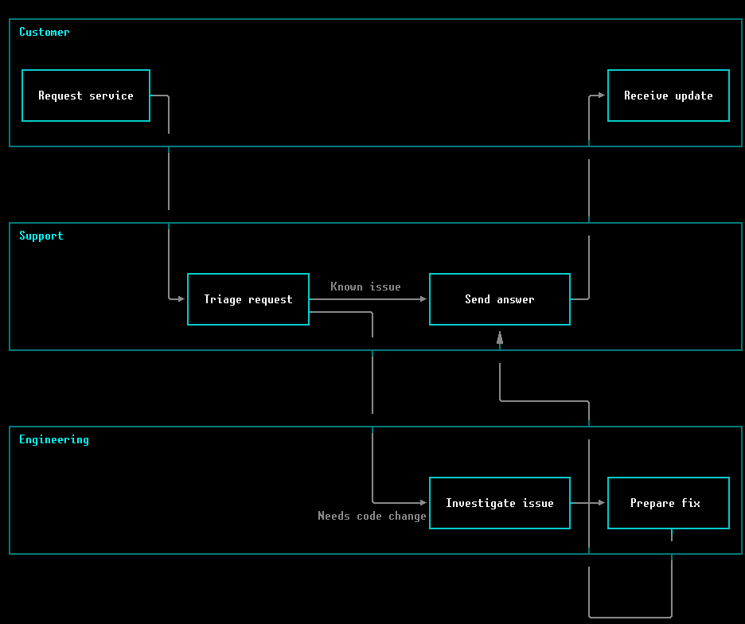

## timeline

Rendered with `-t default -w 120`.

```mermaid
timeline
    title Project Milestones
    2024 Q1 : Requirements
    2024 Q2 : Design : Prototype
    2024 Q3 : Development
    2024 Q4 : Launch
```

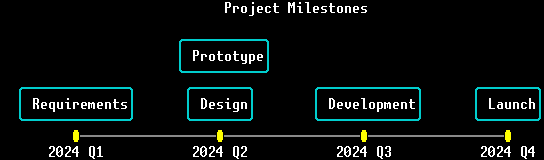

## treemap

Rendered with `-t default -w 120`.

```mermaid
treemap-beta
    "Services"
        "API": 40
        "Web": 30
        "Worker": 20
    "Infra"
        "DB": 25
        "Cache": 15
```

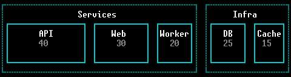

## treemap-wrap

Rendered with `-t blueprint -w 60`.

```mermaid
treemap-beta
"nvme0n1"
    "nvme0n1p1": 512
    "nvme0n1p2": 1999
"nvme1n1"
    "nvme1n1p1": 2000
"nvme2n1"
    "nvme2n1p1": 1000
    "nvme2n1p2": 1000
"sda"
    "sda1": 4000
```

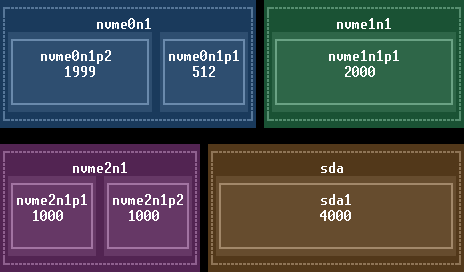

## treeview

Rendered with `-t default -w 120`.

```mermaid
treeView-beta
    mmaid-go/
        cmd/
            mmaid/
                main.go
        internal/
            diagram/  ## one file per type
            renderer/
        README.md
```

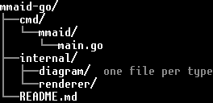

## usecase

Rendered with `-t default -w 120`.

```mermaid
usecase-beta
    actor Customer("Customer")
    actor Agent("Support Agent")
    systemBoundary Storefront
        Browse("Browse catalogue")
        Checkout("Place order")
        Pay("Take payment")
    end
    Customer --> Browse
    Customer --> Checkout
    Agent --> Checkout
    Checkout ..> : include Pay
```

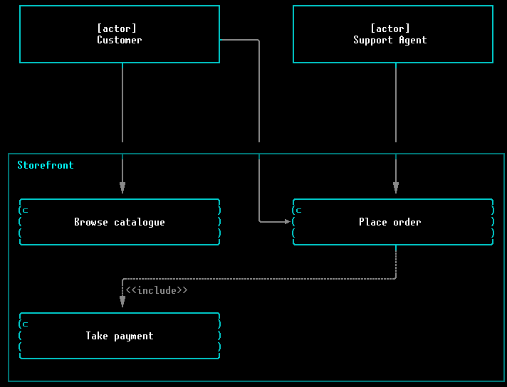

## venn

Rendered with `-t default -w 120`.

```mermaid
venn-beta
    title What makes a good feature
    set Desirable
    set Feasible
    set Viable
    union Desirable,Feasible["Buildable"]
    union Feasible,Viable["Sustainable"]
    union Desirable,Viable["Marketable"]
    union Desirable,Feasible,Viable["Ship it"]
```

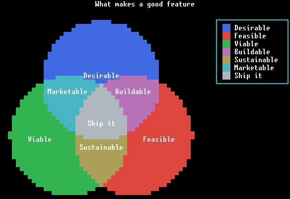

## venn-ascii

Rendered with `-a`.

```mermaid
venn-beta
    title What makes a good feature
    set Desirable
    set Feasible
    set Viable
    union Desirable,Feasible["Buildable"]
    union Feasible,Viable["Sustainable"]
    union Desirable,Viable["Marketable"]
    union Desirable,Feasible,Viable["Ship it"]
```

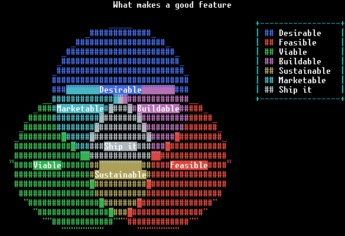

## wardley

Rendered with `-t default -w 120`.

```mermaid
wardley-beta
    title Tea Shop Value Chain
    anchor Business [0.95, 0.63]
    component Cup of Tea [0.79, 0.61]
    component Tea [0.63, 0.81]
    component Hot Water [0.52, 0.80]
    component Kettle [0.43, 0.35] (buy)
    component Power [0.10, 0.70] (market)
    Business -> Cup of Tea
    Cup of Tea -> Tea
    Cup of Tea -> Hot Water
    Hot Water -> Kettle
    Kettle -> Power
    evolve Kettle 0.62
    note "Standard power lets kettles evolve" [0.30, 0.20]
```

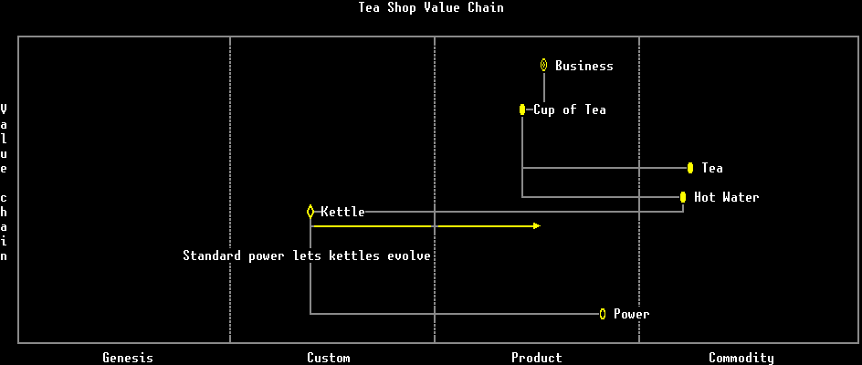

## wide-label

Rendered with `-t default -w 120`.

```mermaid
graph LR
    A[日本語テキスト] --> B[emoji 🚀 ok]
```

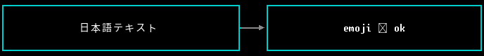

## xychart

Rendered with `-t default -w 120`.

```mermaid
xychart-beta
    title "Monthly Revenue"
    x-axis [Jan, Feb, Mar, Apr, May]
    y-axis "Revenue ($K)" 0 --> 100
    bar [45, 52, 68, 73, 91]
    line [45, 52, 68, 73, 91]
```

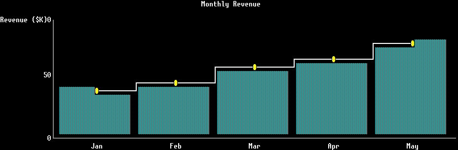

## zenuml

Rendered with `-t default -w 120`.

```mermaid
zenuml
    title Order checkout
    @Actor Customer
    Cart
    @Database Inventory
    Customer->Cart: add item
    // reserve stock, then charge
    receipt = Cart.checkout(token) {
      Inventory.reserve(sku)
      if (inStock) {
        Payments.charge(token)
        return receipt
      } else {
        return backorder
      }
    }
```

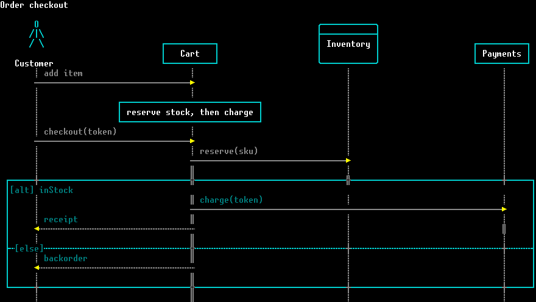
